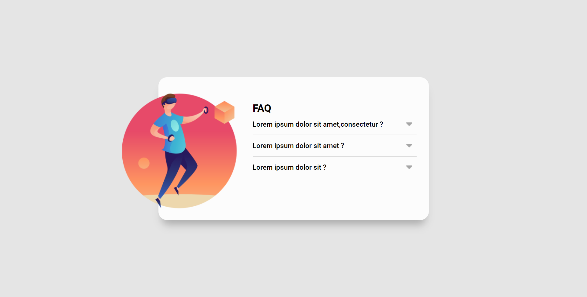

# Acordeon

## Visualização em desktop

## Linguagens utilizadas
- HTML
- CSS
- JavaScript

## Comentarios

Projeto proposto pelo curso Devquest, em que o desafio seria fazer um 'acordeon', onde perguntas entariam visíveis e as repostas apenas deixariam de ser ocultas se o usuário dar um click.Não consegui realizar o desafio com perfeição(não consegui fazer uma resposta se ocultar, após outra ser mostrada), mas creio que ta desafio foi essencial para meu desenvolvimento.